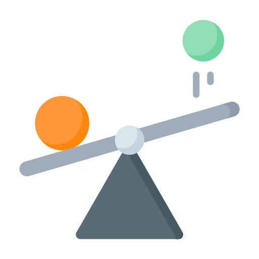

# Rapier Physics 🔌

-orange)

    
     
    <i>Rapier Physics for Vatom Spaces</i>
      

This plugin is designed to be used from within [Vatom Spaces](https://vatom.com). It provides synchronized physics simulation across the space, using the Rapier physics library.

## Building the plugin
- Ensure you have [Node.js](https://nodejs.org) installed.
- Install dependencies: `npm install`
- Build the plugin: `npm run build`

## Developing locally
- Start the dev server: `npm start`
- Load the plugin in your space. Select Plugins, press the (+) icon and then paste the address: [http://localhost:9000/plugin.js](http://localhost:9000/plugin.js)
- After making code changes, refresh the page

> **Note:** You can only sideload plugins in a space you are the owner of.

## Publishing the plugin
- Run: `npm run publish`
